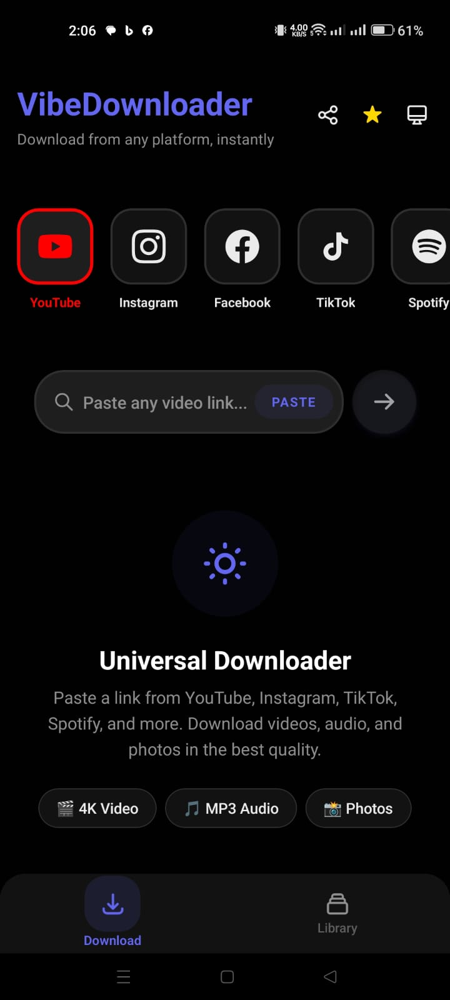
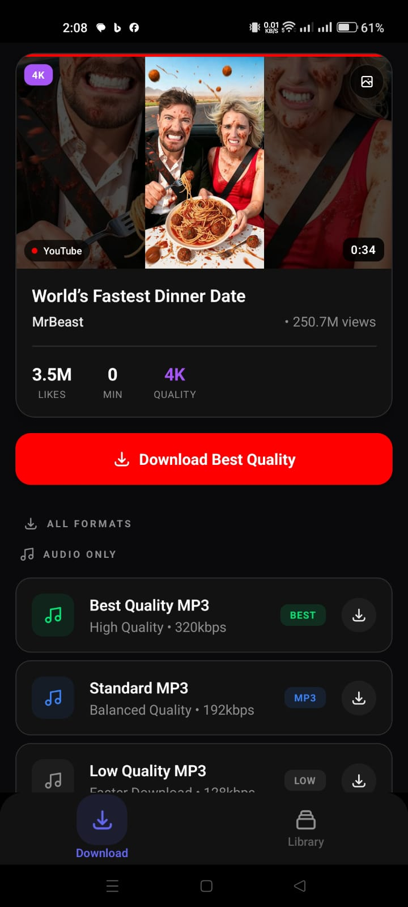
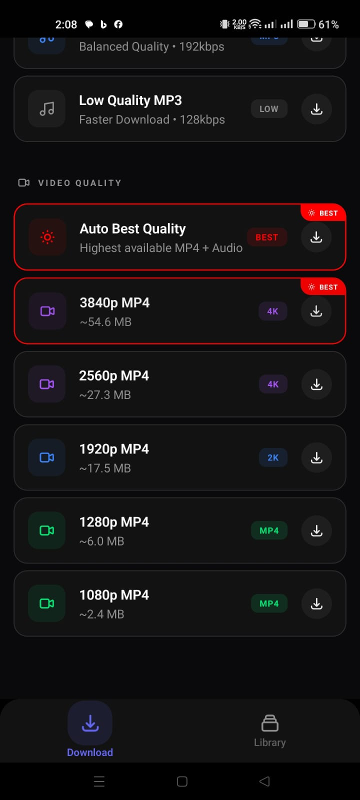
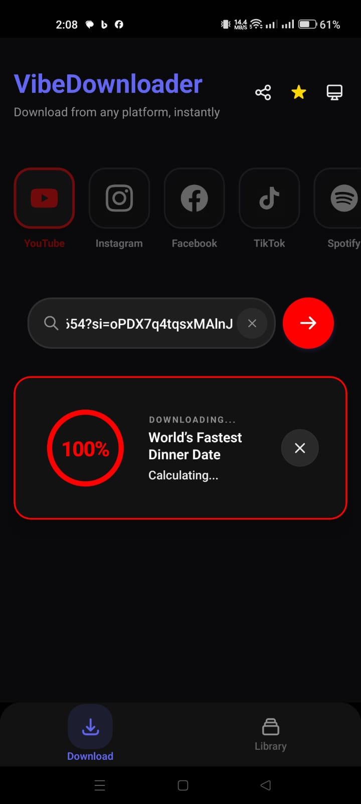
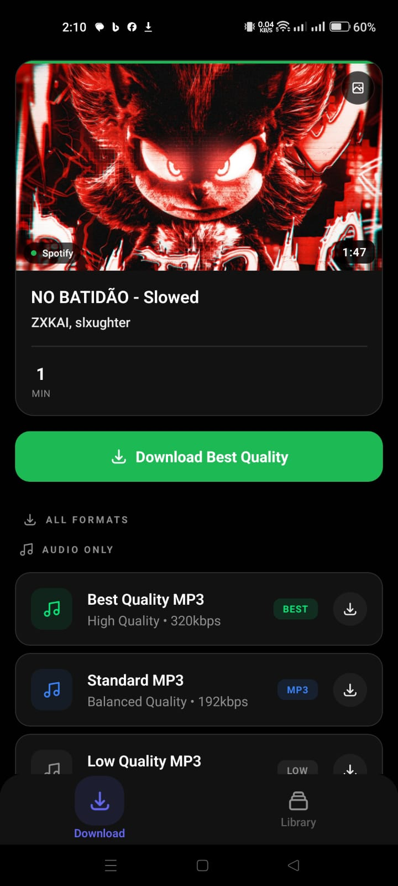
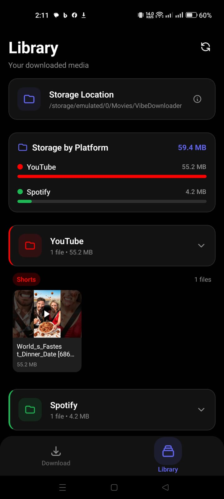
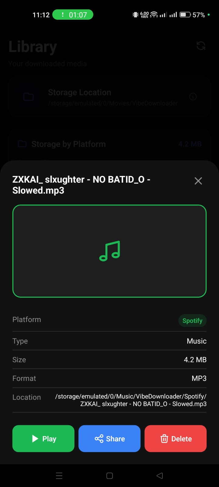

<div align="center">
  
  <br />
  <br />

  <h1>VibeDownloader Mobile</h1>
  
  <p>
    <strong>The premium open-source video downloader for Android.</strong>
  </p>
  
  <p>
    Download videos, audio, and playlists from YouTube, Instagram, Tiktok, Spotify, and more — directly to your device, ad-free, and privacy-first.
  </p>

  <p>
    <a href="https://github.com/naeem5877/vibedownloader-android">
      
    </a>
    <a href="https://github.com/naeem5877/vibedownloader-desktop">
      
    </a>
  </p>

  <p>
    <a href="https://github.com/naeem5877/vibedownloader-android/releases/latest">
      
    </a>
    <a href="https://github.com/naeem5877/vibedownloader-android/releases">
      
    </a>
  </p>
</div>

<br />

---

## 🌟 Why VibeDownloader?

VibeDownloader Mobile is built for users who want **native performance, zero ads, and total control**.

Unlike web-based downloaders cluttered with ads and trackers, VibeDownloader runs **entirely on your device**, powered by the robust `yt-dlp` engine under the hood.

<div align="center">

### 🚫 No Ads • 🔒 No Tracking • ✨ Native Experience

</div>

---

## ✨ Key Features

<table>
<tr>
<td width="50%">

### 🎥 Multi-Platform Support
Download from YouTube, Instagram (Reels, Stories), TikTok (No Watermark), Facebook, X (Twitter), Pinterest, and SoundCloud.

### 🎵 Spotify & Music
Download tracks, albums, and playlists from Spotify with auto-tagged metadata and cover art.

### 🔄 Smart Link Detection
**Share to Download:** Share any link directly from YouTube, Instagram, or Spotify to VibeDownloader for instant processing.

### ⚡ Fast & Efficient
Multi-threaded downloads for maximum speed with background processing support.

</td>
<td width="50%">

### 💎 Premium Design
A sleek, modern dark mode interface with smooth animations and fluid transitions.

### 🔐 Privacy-First
Runs locally with no server-side processing. Your data stays on your phone.

### 📦 Smart Library
Built-in file manager to view, play, and share media. Organized folders by platform (e.g., `Instagram/Reels`).

### 🖼️ Gallery Integration
Videos and photos are automatically saved to your system Gallery. Music goes straight to your audio library.

</td>
</tr>
</table>

---

## 🖼️ Screenshots

<div align="center">
  
  
  
  
  <br />
  <br />
  
  
  
  
</div>

---

## 💻 Also Available on Desktop

Need to download 4K videos on your PC? Check out VibeDownloader Desktop for **Windows, macOS, and Linux**.

<div align="center">
  <a href="https://github.com/naeem5877/vibedownloader-desktop">
    
  </a>
</div>

---

## 📥 Download & Installation

<div align="center">

### 🤖 Android

</div>

1. Download the latest `.apk` file from the [**Releases page**](https://github.com/naeem5877/vibedownloader-android/releases/latest).
2. Open the downloaded file.
3. If prompted, allow installation from **Unknown Sources** (this is safe, the app is open source!).
4. Click **Install**.

> **Note:** Since this app downloads from YouTube, it cannot be published on the Google Play Store due to their policies.

---

## 🛠️ For Developers

Built with **React Native** and **TypeScript**.

### Setup Development Environment

```bash
# Clone the repository
git clone https://github.com/naeem5877/vibedownloader-android.git
cd vibedownloader-android

# Install dependencies
npm install

# Run on Android
npm run android
```

### Tech Stack

- **Framework:** React Native (0.73+)
- **Language:** TypeScript
- **Engine:** yt-dlp (Python via Chaquopy)
- **UI:** Custom Native Components

---

## 🤝 Contributing

Contributions are welcome!

1. **Fork** the repository
2. Create a **feature branch** (`git checkout -b feature/amazing-feature`)
3. **Commit** your changes (`git commit -m 'Add some amazing feature'`)
4. **Push** to the branch (`git push origin feature/amazing-feature`)
5. Open a **Pull Request**

Please follow our [Code of Conduct](CODE_OF_CONDUCT.md).

### Areas We'd Love Help With:

- 🐛 Bug fixes and stability improvements
- 🌐 Translation and internationalization
- 📝 Documentation improvements
- ✨ New feature development
- 🎨 UI/UX enhancements
- 📱 Android-specific optimizations

---

## 📄 License & Brand Usage

### Code License

This project is licensed under the **GNU GPL v3.0**.

You are free to:
- ✅ View the source code
- ✅ Modify the code
- ✅ Distribute modified versions

**Under the condition that:**
- 📋 You disclose the source code
- 📋 State all changes made
- 📋 Use the same GPL v3.0 license

See the [LICENSE](LICENSE) file for full details.

### Brand Notice

⚠️ **The VibeDownloader name, logo, and branding are reserved.**

If you create a fork or modified version:
- ❌ Must **NOT** use the "VibeDownloader" name
- ❌ Must **NOT** use the official logo
- ❌ Must **NOT** present itself as an official build

**Why?** This helps users distinguish official releases from community forks and ensures trust in the brand.

---

## 📞 Support & Community

<div align="center">

[](https://github.com/naeem5877/vibedownloader-android/issues)
[](https://github.com/naeem5877/vibedownloader-android/stargazers)
[](LICENSE)

</div>

- 🐛 **Found a bug?** [Open an issue](https://github.com/naeem5877/vibedownloader-android/issues)
- 💡 **Have an idea?** [Start a discussion](https://github.com/naeem5877/vibedownloader-android/discussions)
- ⭐ **Like the project?** Give it a star!

---

## 🙏 Acknowledgments

- Built with [yt-dlp](https://github.com/yt-dlp/yt-dlp) - The powerful video downloader
- Powered by [React Native](https://reactnative.dev/) - Cross-platform mobile framework
- Python integration via [Chaquopy](https://chaquo.com/chaquopy/) - Python for Android

---

<div align="center">
  
### Made with ❤️ by [Naeem](https://github.com/naeem5877)

**If you find this project useful, consider giving it a ⭐**

<sub>© 2025 VibeDownloader. Released under GPL v3.0 License.</sub>

</div>
