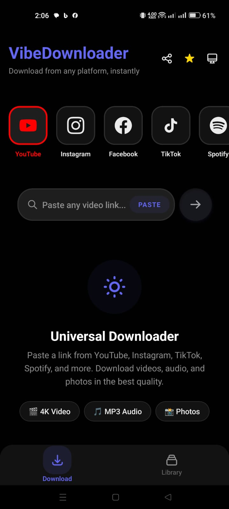
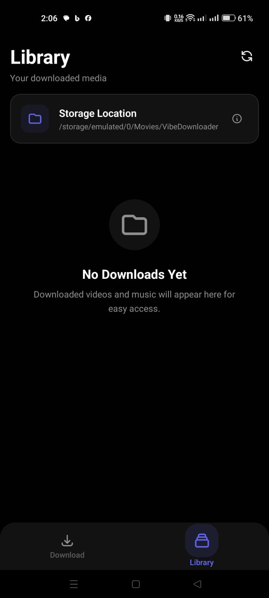
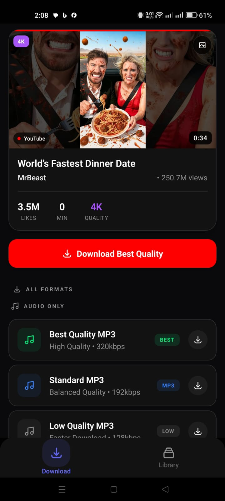
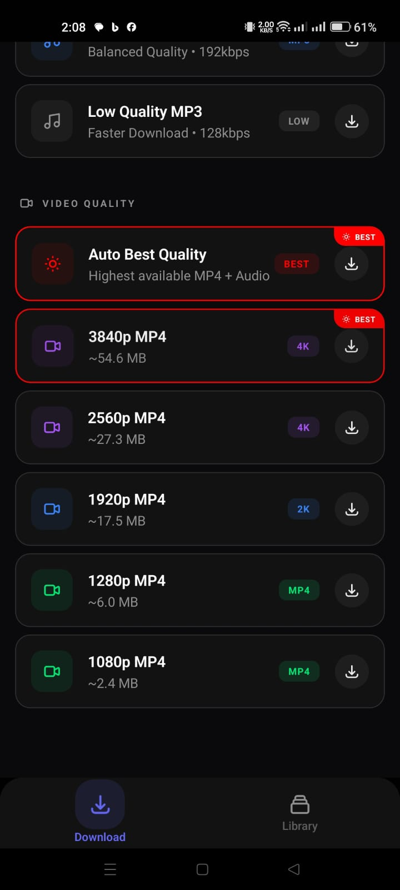
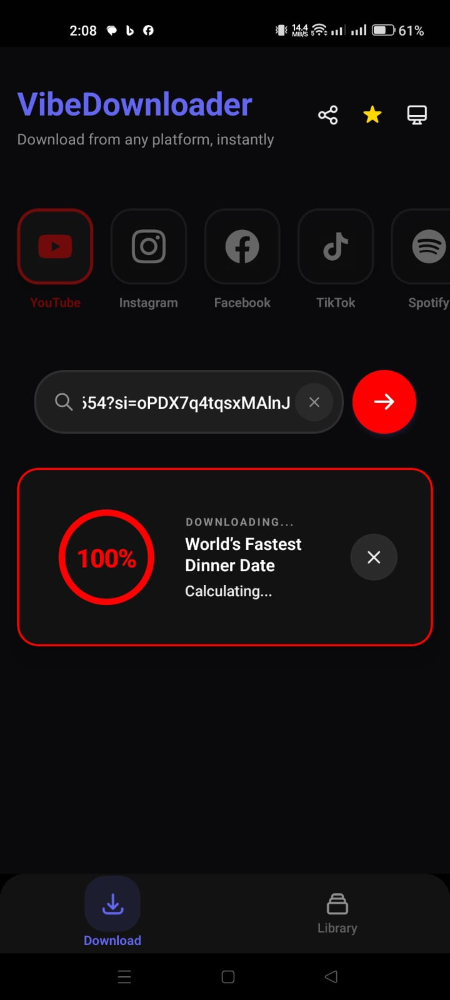
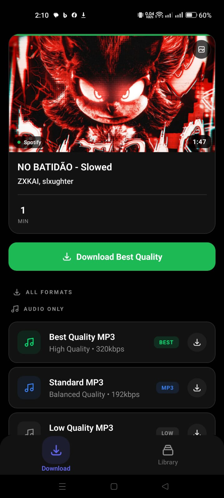
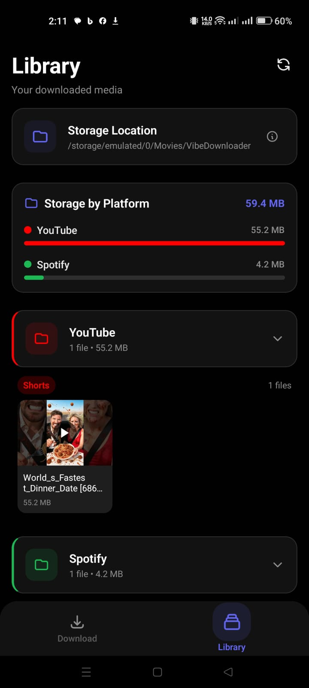
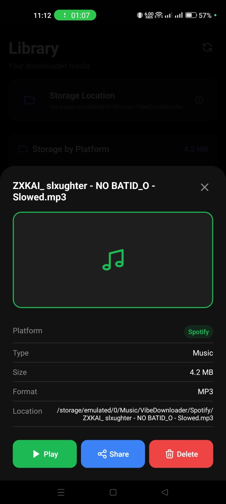

<div align="center">
  <a href="https://github.com/naeem5877/vibedownloader-desktop">
    
  </a>
  <br />
  <br />

  <h1>VibeDownloader</h1>
  
  <p>
    <strong>An open-source video downloader for Windows, macOS, Linux, and Android.</strong>
  </p>
  
  <p>
    Download videos, audio, subtitles, lyrics, and playlists from YouTube, Instagram, TikTok, Twitch, Facebook, X, SoundCloud, Spotify, and more — locally, ad-free, and privacy-first.
  </p>

  <p>
    <a href="https://github.com/naeem5877/vibedownloader-desktop">
      
    </a>
    <a href="https://github.com/naeem5877/vibedownloader-android">
      
    </a>
    <a href="https://vibedownloader.me">
      
    </a>
  </p>

  <p>
    <a href="https://github.com/naeem5877/vibedownloader-android/releases/latest">
      
    </a>
    <a href="https://github.com/naeem5877/vibedownloader-android/releases">
      
    </a>
    <a href="https://github.com/naeem5877/vibedownloader-desktop/releases/latest">
      
    </a>
    <a href="https://img.shields.io/badge/build-check_actions-green?style=for-the-badge" alt="Build Status">
      Build Status
    </a>
  </p>
</div>

<br />

---

## 🌟 Why VibeDownloader?

VibeDownloader is designed for users who value **control, speed, and privacy**.

Unlike web-based downloaders cluttered with ads and trackers, VibeDownloader runs **entirely on your device**, powered by the industry-standard `yt-dlp` engine — with a fast metadata path that resolves most links before yt-dlp is even needed.

<div align="center">

### 🚫 No Accounts • 🔒 Private by Design • ✨ No Nonsense

</div>

---

## 🆕 What's New in v2.0.0

The biggest release yet — real language control, a music section that actually works, and far more reliable YouTube downloads.

### 🎬 YouTube Upgrades

- **Subtitles Download** — videos with captions now show a **Subtitles** option. Pick a language and save the subtitles as an SRT file.
- **Multi-Language Audio Tracks** — if a video has more than one audio track (for example Bangla, English, Hindi), you can now choose the exact language you want.
- **Audio or Video in Your Language** — download the selected language as an audio file, or as a video with that audio track.
- **Smarter Format Detection** — the app now checks the quality list YouTube returns. If it looks incomplete (for example only 360p), it tries again with a different player before showing you the result.
- **Faster Metadata** — titles, formats, thumbnails, subtitles and audio tracks are resolved straight from YouTube's player response, so most links load much faster. yt-dlp is still used as a transparent fallback, and for every real download.

### 🎵 Lyrics Download (Spotify & YouTube Music)

- **Lyrics for Music Tracks** — when a song has lyrics available, a new lyrics option appears in the music section.
- **Line by Line** — synced lyrics, one line at a time.
- **Word by Word** — lyrics timed word by word, for karaoke-style use.
- **Plain Text** — clean lyrics without timestamps.
- **Translation** — download a translated version of the lyrics.

### 🎧 Music Downloading

- **WAV Format Added** — download songs as uncompressed WAV for the highest audio fidelity.
- **Better Metadata Embedding** — downloaded songs now include **track, album and artist** details, so they show up correctly in your music player.
- **Spotify: 4 Audio Formats** — Spotify downloads now offer four audio format options.
- **Real Cover Art** — cover art is read from the file's embedded metadata, and video posters are generated by the app, so your library finally shows what you actually downloaded.

### 📸 Stories

- **Instagram Stories Fixed** — story downloading works again.
- **Facebook Stories Fixed** — story downloading works again.

### 🛡️ Bot Protection & Age Restriction

- **Improved YouTube Reliability** — reworked how the app talks to YouTube to reduce "bot protection" and age-restriction errors, including on PCs where it previously failed.
- **Automatic Player Fallback** — if one YouTube player is refused, the app tries another instead of showing an error.
- **Better Error Messages** — the app reads the real reason yt-dlp reports, so you see a clearer message when something goes wrong.
- **Stuck Requests Cancelled Properly** — a timed-out request now stops the downloader process instead of leaving it running in the background.
- **More Secure Connections** — removed the setting that skipped certificate checks.

### 🧰 Diagnostics & Debugging

- **Sentry Error Reporting** — added to help find and fix crashes faster. Links and file paths are scrubbed before anything is sent.
- **Private Logs** — video links are redacted from logs.
- **`ffmpeg` & `ffprobe` Fixed** — the post-processing tools are now found reliably on every supported ABI, instead of silently skipping conversion.
- **16 KB Page Size Support** — native libraries updated so the app runs correctly on 16 KB page size devices.

---

See the full list on the [**Releases page**](https://github.com/naeem5877/vibedownloader-android/releases/latest).

---

## ✨ Key Features

<table>
<tr>
<td width="50%" valign="top">

### 🎥 Multi-Platform Support
Videos, reels, shorts, stories & playlists from YouTube, Instagram, TikTok, Facebook, X, Pinterest, SoundCloud and Twitch

### 📖 Stories
Download Instagram and Facebook stories directly

### 💬 Subtitles & Audio Languages
Download subtitles as SRT, pick the subtitle language, and choose the exact audio language when a video has multiple tracks — save it as audio or video

### 🎤 Lyrics Download
Line by line, word by word, plain text, or translated lyrics for Spotify and YouTube Music tracks

### 🎵 Spotify & YouTube Music Downloads
Tracks, albums & playlists with full metadata and cover art

### 🎧 Studio-Quality Music
WAV export plus embedded track, album and artist details, so songs look right in any music player

### ✂️ Cut & Download
Trim any video or song with the timeline editor before saving — clean output, no leftovers

</td>
<td width="50%" valign="top">

### 📦 Batch Downloading
Queue videos & audio with per-item quality controls, then watch progress per item

### 🔴 Live Recording
Record a live broadcast until you stop — auto-finalized as a playable file

### 📂 Smart Library
A built-in library with real thumbnails, playback, share and delete — organized by platform and content type

### 🖼️ Gallery Integration
Videos and photos are saved to your system Gallery, and music goes straight to your audio library

### 🔄 Share to Download
Share any link straight from YouTube, Instagram, TikTok or Spotify into VibeDownloader for instant processing

### 💎 Modern UI
Clean dark interface with smooth animations and fluid transitions

### 🔐 Privacy-First
Local processing — no accounts, no ads, no tracking of your downloads

</td>
</tr>
</table>

---

## 🖼️ Screenshots

<div align="center">
  
  
  <br />
  <br />
  
  
  <br />
  <br />
  
  
  <br />
  <br />
  
  
</div>

---

## 📥 Download & Installation

<div align="center">

### 🤖 Android

</div>

<div align="center">
  <a href="https://github.com/naeem5877/vibedownloader-android/releases/latest">
    
  </a>
</div>

1. Download the `.apk` file from the [**Android Releases page**](https://github.com/naeem5877/vibedownloader-android/releases/latest)
2. Enable **Install from unknown sources** in your device settings
3. Open the downloaded APK and install
4. Launch VibeDownloader from your app drawer

**Requirements:** Android 7.0 (API 24) or newer.

> **Note:** The Android version is available exclusively through GitHub releases. We don't distribute through the Google Play Store to avoid restrictions and maintain full feature compatibility.

---

## 💻 Also Available on Desktop

Need to download 4K videos on your PC? Check out VibeDownloader Desktop for **Windows, macOS, and Linux** — including the browser extension, batch queue, and Cut feature.

<div align="center">
  <a href="https://github.com/naeem5877/vibedownloader-desktop">
    
  </a>
</div>

---

## 🍪 Cookies (Optional)

Some content needs a signed-in session, such as age-restricted videos or private accounts. You can add your cookies for a platform in the app.

- Cookies are stored **only on your phone** and are used only to authenticate your own downloads
- They are never uploaded to any server
- **Tip:** for the most reliable result, export your cookies from a **private/incognito window**, then close that window right away. A browser session that stays open can rotate its cookies and make the exported ones stop working.

---

## 🧰 Troubleshooting

If a download fails or only shows low quality:

1. Open **Settings** and make sure the downloader (yt-dlp) is up to date
2. Try again without cookies, or with freshly exported cookies
3. Turn off any VPN. Some VPN and shared IPs are blocked by YouTube
4. If it still fails, open a [new issue](https://github.com/naeem5877/vibedownloader-android/issues) with the video link (a public one), your app version, and your device

---

## 🔐 Privacy

- Downloads, conversions and cookies are processed **locally on your device**
- No accounts, no ads
- **Crash and error reports:** VibeDownloader can use [Sentry](https://sentry.io) to find and fix bugs. File paths and personal data are not attached, and cookies are never included
- You can read exactly what is collected in this repository — the app is fully open source

---

## 🛠️ For Developers

Android is built with **React Native** and **TypeScript**, on top of **Kotlin** native modules for the download engine.

### Android Development

```bash
# Clone the repository
git clone https://github.com/naeem5877/vibedownloader-android.git
cd vibedownloader-android

# Install dependencies
npm install

# Start Metro
npm start

# Build & run on a device or emulator
npm run android
```

#### Build & Test Commands

```bash
# Debug APK
npm run build:debug

# Release APK
npm run build:release

# Lint
npm run lint

# Tests
npm test

# Clean Gradle output
npm run clean
```

#### Requirements

- Node.js and npm
- JDK 17
- Android Studio with SDK Platform 36 and Build Tools
- `minSdkVersion 24` · `targetSdkVersion 36` · `compileSdkVersion 36`

#### Tech Stack

- **Framework:** React Native 0.83 with TypeScript
- **Native:** Kotlin modules for the download engine, MediaStore, and thumbnails
- **Engine:** `yt-dlp` running on a bundled CPython runtime, with bundled `ffmpeg`/`ffprobe` (`io.github.junkfood02.youtubedl-android`)
- **JS challenges:** QuickJS, so yt-dlp can solve YouTube's JS challenges without falling back to the slow pure-Python interpreter
- **Metadata:** direct InnerTube player-response resolution with an automatic yt-dlp fallback
- **Crash reporting:** `@sentry/react-native`

#### Project Structure

```
vibedownloader-android/
├── src/
│   ├── components/     # Sheets, pickers and cards
│   ├── hooks/          # Download, metadata and library hooks
│   ├── screens/        # Home, Library, Splash, Onboarding
│   ├── services/       # YouTube Music and platform services
│   ├── theme/          # Colors, spacing and typography
│   └── utils/          # Shared helpers
├── android/
│   └── app/src/main/java/com/vibedownloadermobile/
│       ├── ytdlp/      # Download engine, InnerTube, thumbnails
│       └── story/      # Story-only download path
├── Screenshots/
└── __tests__/
```

#### How downloads work

1. A pasted or shared link is resolved through the InnerTube player response for fast metadata (formats, subtitles, audio tracks, thumbnails).
2. If that path can't handle the link, the app transparently falls back to `yt-dlp`.
3. `yt-dlp` runs on the bundled CPython runtime; `ffmpeg`/`ffprobe` handle post-processing, WAV export and metadata embedding.
4. Finished files are written to the public Gallery/audio library through MediaStore, and the library generates cached thumbnails from the file itself.

---

## 🤝 Contributing

Contributions are welcome and appreciated! Here's how you can help:

1. **Fork** the repository (Desktop or Android)
2. Create a **feature branch** (`git checkout -b feature/amazing-feature`)
3. **Commit** your changes (`git commit -m 'Add some amazing feature'`)
4. **Push** to the branch (`git push origin feature/amazing-feature`)
5. Open a **Pull Request**

Please follow our [Code of Conduct](CODE_OF_CONDUCT.md) and coding standards.

### Areas We'd Love Help With:

- 🐛 Bug fixes and stability improvements
- 🌐 Translation and internationalization
- 📝 Documentation improvements
- ✨ New feature development
- 🎨 UI/UX enhancements
- 📱 Android-specific optimizations

---

## 📄 License & Brand Usage

### Code License

This project is licensed under the **GNU GPL v3.0**.

You are free to:
- ✅ View the source code
- ✅ Modify the code
- ✅ Distribute modified versions

**Under the condition that:**
- 📋 You disclose the source code
- 📋 State all changes made
- 📋 Use the same GPL v3.0 license

See the [LICENSE](LICENSE) file for full details.

### Brand Notice

⚠️ **The VibeDownloader name, logo, and branding are reserved.**

If you create a fork or modified version:
- ❌ Must **NOT** use the "VibeDownloader" name
- ❌ Must **NOT** use the official logo
- ❌ Must **NOT** present itself as an official build

**Why?** This helps users distinguish official releases from community forks and ensures trust in the brand.

---

## 📞 Support & Community

<div align="center">

[](https://github.com/naeem5877/vibedownloader-desktop/issues)
[](https://github.com/naeem5877/vibedownloader-android/issues)
[](https://github.com/naeem5877/vibedownloader-android/stargazers)
[](LICENSE)

</div>

- 🐛 **Found a bug?** [Desktop Issues](https://github.com/naeem5877/vibedownloader-desktop/issues) | [Android Issues](https://github.com/naeem5877/vibedownloader-android/issues)
- 💡 **Have an idea?** [Start a discussion](https://github.com/naeem5877/vibedownloader-android/discussions)
- ⭐ **Like the project?** Give it a star on both repositories!

---

## 🙏 Acknowledgments

- Built with [yt-dlp](https://github.com/yt-dlp/yt-dlp) - The powerful video downloader
- Android powered by [React Native](https://reactnative.dev/) - Mobile framework
- Native download runtime via [youtubedl-android](https://github.com/junkfood02/youtubedl-android) - CPython and ffmpeg for Android
- Desktop powered by [Electron](https://www.electronjs.org/) - Cross-platform desktop framework

---

<div align="center">
  
### Made with ❤️ by [Naeem](https://github.com/naeem5877)

**If you find this project useful, consider giving it a ⭐**

<sub>© 2026 VibeDownloader. Released under GPL v3.0 License.</sub>

</div>